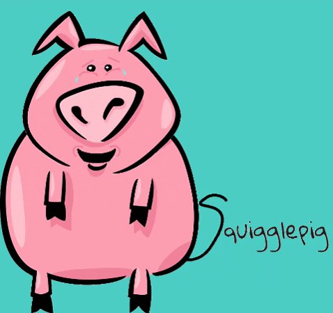

  

&nbsp;

Squigglepig wants you to have fun with your friends. Draw an image, have your friends write funny captions, choose and winner, and have a laugh.

## Contributors 🚀

<!-- ALL-CONTRIBUTORS-LIST:START - Do not remove or modify this section -->
<!-- prettier-ignore-start -->
<!-- markdownlint-disable -->
<table>
  <tr>
    <td align="center"><a href="https://rwilliams01101.github.io/Portfolio/"> <b>R. Alan Williams</b></a> <a href="https://github.com/rwilliams01101/squigglepig_app/commits?author=rwilliams01101" title="Code">💻</a></td>
    <td align="center"><a href="#"> <b>Chris Wells</b></a> <a href="https://github.com/rwilliams01101/squigglepig_app/commits?author=chriswells1995" title="Code">💻</a></td>
    <td align="center"><a href="#"> <b>Lukas Hirsch</b></a> <a href="https://github.com/rwilliams01101/squigglepig_app/commits?author=lhirsch1" title="Code">💻</a></td>
    <td align="center"><a href="#"> <b>Maxwell Hankner</b></a> <a href="https://github.com/rwilliams01101/squigglepig_app/commits?author=maxwellhankner" title="Code">💻</a></td>
  </tr>
</table>

<!-- markdownlint-enable -->
<!-- prettier-ignore-end -->

<!-- ALL-CONTRIBUTORS-LIST:END -->

## Thanks

## Built With

- Socket.io
- Node.js
- React Native

## Setup

Clone this repo to your desktop and run `npm install` to install all the dependencies.

---

## Usage

Once the dependencies are installed, you can run `npm run start` to start the application. You will then be able to access Expo Developer Tools at localhost:19002.

Click "Run in web browser" to launch.

---

## License

This project is licensed under the terms of the **MIT** license.
